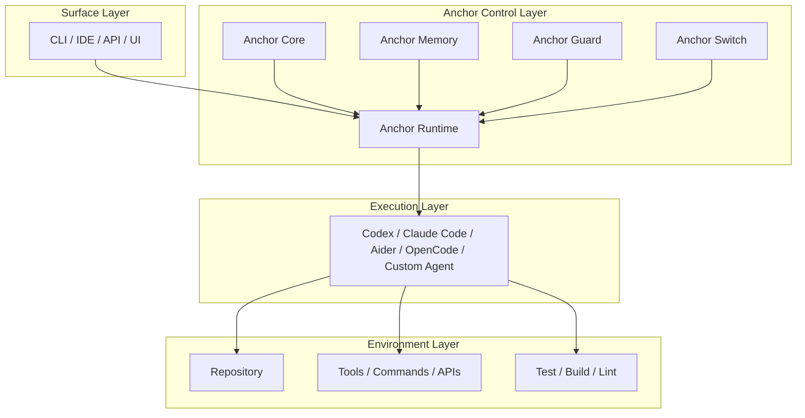

# Anchor System Boundary

## Definition

Anchor is a backend-agnostic headless control runtime for coding agents.

It sits **above execution backends** and manages execution control for long-horizon coding tasks.

---

## What Anchor Owns

Anchor is responsible for:

- goal anchoring
- round construction
- structured evaluation
- failure memory
- loop detection
- strategy switching
- stop policy
- final continuation / stop decisions

---

## What Anchor Does Not Own

Anchor does **not** directly perform code execution work.

It does not:

- read repository files by itself
- write code by itself
- run shell commands by itself
- call coding tools by itself
- own the IDE or terminal experience
- provide model inference by itself

Those responsibilities belong to the execution backend.

---

## Execution Backend Boundary

The execution backend is responsible for:

- reading files
- editing code
- generating patches
- running commands
- using tools
- interacting with the repository
- producing round output artifacts

Examples include:

- Codex
- Claude Code
- Aider
- OpenCode
- Goose
- custom coding agents

---

## External Environment Boundary

The environment outside Anchor includes:

- repository
- filesystem
- shell / command runner
- build / lint / test systems
- tool APIs
- IDE / CLI / UI surfaces

Anchor may observe signals from these systems through backend results, but does not own them.

---

## Layered View

---

## Runtime Relationship

Anchor should be understood as a **control plane**, not an execution worker.

- If the backend is the worker,
- Anchor is the runtime that decides whether the worker should continue, patch, change strategy, or stop.

---

## Core Separation Principle

**Execution belongs to the backend.**  
**Control belongs to Anchor.**
