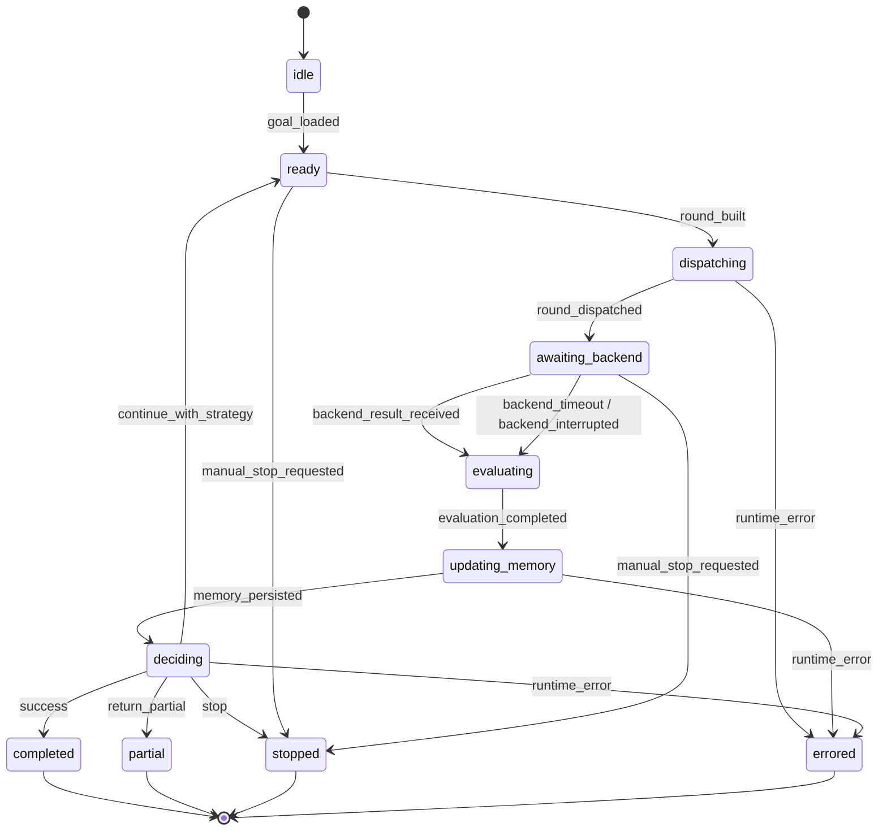

# Anchor Execution State Machine v0.1

## Purpose

This document defines the deterministic runtime state machine that sits under the round protocol.

The round protocol explains **what** objects exist.
This state machine explains **when** they are created, **which transitions are legal**, and **which stop/continue decision wins** when multiple conditions are true.

---

## Runtime States

Anchor runtime has the following top-level states:

- `idle`
- `ready`
- `dispatching`
- `awaiting_backend`
- `evaluating`
- `updating_memory`
- `deciding`
- `completed`
- `partial`
- `stopped`
- `errored`

### State Semantics

#### idle
No goal is loaded.

#### ready
A goal is loaded and Anchor can construct the next round.

#### dispatching
Anchor is materializing `RoundInput` and handing it to a backend adapter.

#### awaiting_backend
Anchor is waiting for a normalized `BackendResult`.

#### evaluating
Anchor is converting `BackendResult` plus policy checks into `EvaluationResult`.

#### updating_memory
Anchor is appending the round record and updating loop / failure summaries.

#### deciding
Anchor is applying stop policy and strategy policy to select the next action.

#### completed
Terminal success state. Success criteria have passed.

#### partial
Terminal partial-return state. Best-known output is returned with unresolved items.

#### stopped
Terminal non-success stop state.

#### errored
Terminal runtime infrastructure state. Used only when Anchor itself cannot continue safely, for example memory persistence failure or adapter protocol corruption.

---

## Round States

Each round should also carry a local lifecycle:

- `constructed`
- `dispatched`
- `running`
- `completed`
- `failed`
- `timed_out`
- `interrupted`
- `rejected`

This is separate from top-level runtime state.
The runtime may remain healthy even when a round ends as `failed` or `timed_out`.

---

## Events

Anchor reacts to the following normalized events:

- `goal_loaded`
- `round_built`
- `round_dispatched`
- `backend_result_received`
- `backend_timeout`
- `backend_interrupted`
- `evaluation_completed`
- `memory_persisted`
- `decision_selected`
- `manual_stop_requested`
- `runtime_error`

---

## Transition Table

| Current State | Event | Guard | Action | Next State |
| --- | --- | --- | --- | --- |
| `idle` | `goal_loaded` | valid `GoalCore` | initialize runtime session | `ready` |
| `ready` | `round_built` | stop policy not already triggered | create `RoundInput`, increment tentative round index | `dispatching` |
| `dispatching` | `round_dispatched` | adapter accepted payload | persist round as `dispatched` | `awaiting_backend` |
| `dispatching` | `runtime_error` | adapter contract invalid | capture runtime incident | `errored` |
| `awaiting_backend` | `backend_result_received` | result matches adapter contract | normalize result | `evaluating` |
| `awaiting_backend` | `backend_timeout` | timeout budget reached | synthesize timeout result | `evaluating` |
| `awaiting_backend` | `backend_interrupted` | manual cancel or backend abort | synthesize interrupted result | `evaluating` |
| `evaluating` | `evaluation_completed` | evaluation finished | persist `EvaluationResult` | `updating_memory` |
| `updating_memory` | `memory_persisted` | memory write succeeded | recompute loop state and pattern summaries | `deciding` |
| `updating_memory` | `runtime_error` | persistence failure | capture runtime incident | `errored` |
| `deciding` | `decision_selected` | decision = continue strategy | prepare next round metadata | `ready` |
| `deciding` | `decision_selected` | decision = `stop` | build stop output | `stopped` |
| `deciding` | `decision_selected` | decision = `return_partial` | build partial output | `partial` |
| `deciding` | `decision_selected` | evaluation pass = true | build success output | `completed` |
| any non-terminal | `manual_stop_requested` | always | emit stop output with reason | `stopped` |
| any non-terminal | `runtime_error` | always | emit runtime failure output | `errored` |

---

## Decision Precedence

State transitions must be deterministic.
When multiple conditions are simultaneously true, Anchor should apply the following precedence order:

1. `manual_stop`
2. `runtime_error`
3. `hard_constraint_violation`
4. `success`
5. `severe_loop`
6. `max_rounds`
7. `max_same_failure`
8. `budget_exhausted`
9. `return_partial`
10. `continue_with_strategy`

### Rationale

- Manual stop always wins because it is an external control decision.
- Runtime error wins over task-level logic because Anchor cannot safely continue.
- Hard constraint violation must stop before success claims or retries.
- Success should short-circuit loop and budget checks.
- Severe loop should stop before spending additional budget on repeated failure.
- Partial return is lower priority than hard stop, but higher priority than another retry when policy allows partial delivery.

---

## Stop / Continue Guards

Anchor should compute these booleans during `deciding`:

```ts
interface GuardSnapshot {
  manual_stop: boolean
  runtime_error: boolean
  hard_constraint_violation: boolean
  success: boolean
  severe_loop: boolean
  mild_loop: boolean
  max_rounds_reached: boolean
  max_same_failure_reached: boolean
  budget_exhausted: boolean
  allow_partial: boolean
  has_partial_value: boolean
}
```

Recommended derived rules:

- `return_partial` when `allow_partial && has_partial_value && (max_rounds_reached || budget_exhausted || severe_loop)`
- `stop` when hard constraint is violated and no policy explicitly allows downgrade
- `retry_same` only when no repeating fingerprint is detected and failure severity is `low`
- `patch` when failures are explicit and localized
- `rewrite_local` when the same local slice failed under patch-style correction more than once
- `decompose` when failure is broad, mixed, or task scope is too coarse
- `change_method` when the backend execution mode itself is the suspected limiter

---

## Deterministic Decision Algorithm

```ts
function decide(snapshot: GuardSnapshot): "completed" | "partial" | "stopped" | "continue" {
  if (snapshot.manual_stop) return "stopped"
  if (snapshot.runtime_error) return "stopped"
  if (snapshot.hard_constraint_violation) return "stopped"
  if (snapshot.success) return "completed"
  if (snapshot.severe_loop) {
    return snapshot.allow_partial && snapshot.has_partial_value ? "partial" : "stopped"
  }
  if (snapshot.max_rounds_reached || snapshot.max_same_failure_reached || snapshot.budget_exhausted) {
    return snapshot.allow_partial && snapshot.has_partial_value ? "partial" : "stopped"
  }
  return "continue"
}
```

This algorithm decides terminal vs non-terminal flow.
Strategy selection still happens after this check and only for the `continue` branch.

---

## Strategy Selection Inputs

The strategy selector should consume a normalized summary rather than raw backend output:

```ts
interface StrategyContext {
  current_strategy: string
  latest_failure_types: string[]
  latest_failure_codes: string[]
  repeated_fingerprint_count: number
  repeated_strategy_count: number
  scope_breadth: "narrow" | "medium" | "broad"
  regressions_present: boolean
  backend_blocked: boolean
  command_failures_present: boolean
}
```

Suggested strategy defaults:

- choose `retry_same` for flaky, light, first-time invalid failures
- choose `patch` for narrow failures with clear failed checks
- choose `rewrite_local` for repeated narrow failures in the same slice
- choose `decompose` for broad failures spanning multiple concerns
- choose `change_method` for backend/tooling blockage or repeated strategy exhaustion

---

## Mermaid View



---

## Implementation Notes

- Round construction should be pure with respect to the current goal and memory snapshot.
- Backend adapter errors should be normalized into round-level failures when possible, and runtime-level `errored` only when contract integrity is broken.
- Memory persistence must happen before strategy selection so loop detection is based on the latest round.
- Terminal outputs should always include the last successful validated facts, not only the last failed round summary.
