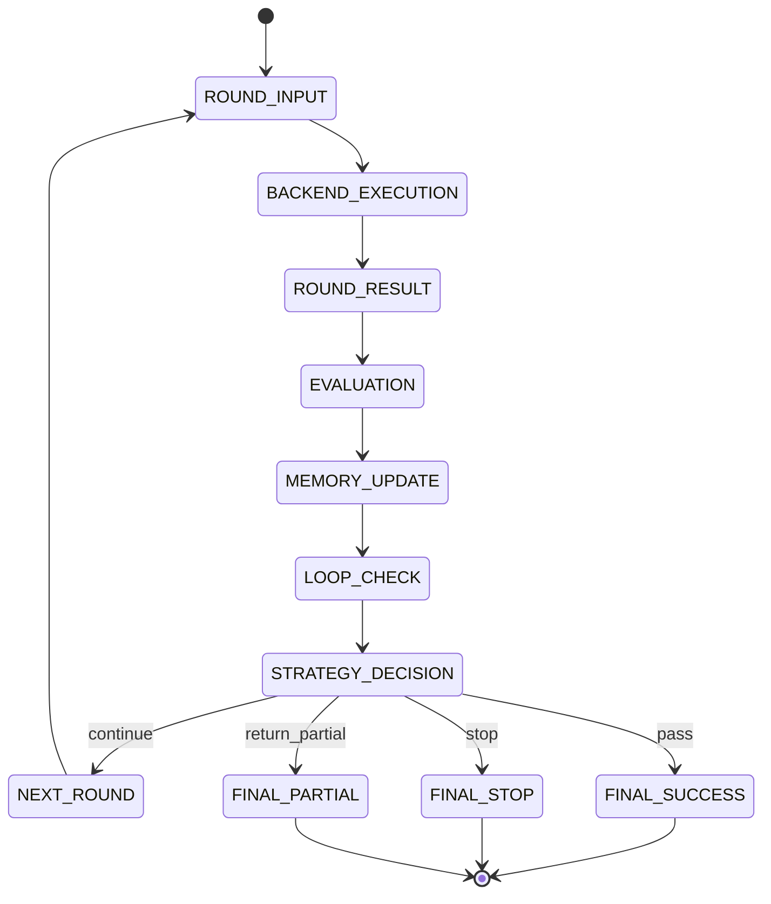

# Anchor Round Protocol v0.1

## Overview

Anchor operates through explicit execution rounds.

A round is the smallest controlled unit of task progression. Each round is evaluated, remembered, and used to determine whether execution should continue, switch strategy, or stop.

A round has six stages:

1. Round Input
2. Backend Execution
3. Round Result
4. Evaluation
5. Memory Update
6. Strategy Decision

---

## Companion Specifications

The round protocol defines the round-level objects.
The following companion documents define implementation constraints around it:

- `execution-state-machine-v0.1.md`
- `backend-adapter-contract-v0.1.md`
- `memory-schema-v0.1.md`

These documents are intended to close the gap between conceptual protocol and runtime implementation.

---

## Core Objects

### GoalCore

```json
{
  "goal_id": "task-001",
  "goal": "Implement the feature described in issue #123",
  "constraints": [
    "Do not modify public API contracts",
    "Keep changes within the auth module",
    "All tests must pass"
  ],
  "success_criteria": [
    "Feature behavior is implemented",
    "Relevant tests pass",
    "No unrelated files are modified"
  ],
  "stop_policy": {
    "max_rounds": 6,
    "max_same_failure": 2,
    "allow_partial": true
  }
}
```

GoalCore is the stable task anchor. It should remain stable across rounds unless explicitly redefined by a higher-level system.

---

### RoundInput

```json
{
  "round_id": "r-003",
  "goal_id": "task-001",
  "strategy": "patch",
  "task_slice": "Fix the failing auth refresh flow without changing public API",
  "context": {
    "relevant_files": [
      "src/auth/refresh.ts",
      "tests/auth/refresh.test.ts"
    ],
    "latest_failure_summary": [
      "Previous attempt fixed token refresh logic but broke error propagation",
      "Tests still failing on expired-session case"
    ]
  },
  "instructions": [
    "Preserve existing successful changes",
    "Only fix the failed checks from the previous round"
  ]
}
```

RoundInput is the compressed, goal-anchored payload sent to the execution backend.

---

### BackendResult

```json
{
  "round_id": "r-003",
  "backend": {
    "backend_id": "claude-code",
    "backend_label": "Claude Code",
    "adapter_version": "0.1.0",
    "execution_mode": "agent-cli"
  },
  "status": "completed",
  "summary": "Patched refresh error handling and updated one test assertion",
  "changes": {
    "files": [
      {
        "path": "src/auth/refresh.ts",
        "change_type": "modified"
      },
      {
        "path": "tests/auth/refresh.test.ts",
        "change_type": "modified"
      }
    ],
    "commands": [
      {
        "command": "pnpm test tests/auth/refresh.test.ts",
        "status": "completed"
      }
    ]
  },
  "artifacts": [
    {
      "type": "patch",
      "ref": "patch://r-003"
    }
  ],
  "blockers": [],
  "notes": [
    "Kept previous token refresh behavior intact"
  ]
}
```

BackendResult describes what the backend did. It does not determine success.
For the full normalized contract, see `backend-adapter-contract-v0.1.md`.

---

### EvaluationResult

```json
{
  "round_id": "r-003",
  "pass": false,
  "failed_checks": [
    {
      "type": "invalid",
      "code": "TEST_FAILURE",
      "detail": "Expired-session test still fails"
    },
    {
      "type": "superficial",
      "code": "PARTIAL_FIX",
      "detail": "Error propagation was adjusted, but failure path remains incomplete"
    }
  ],
  "resolved_checks": [
    "Previous API contract violation is no longer present"
  ],
  "regressions": [],
  "severity": "medium",
  "evaluation_summary": "Progress made, but target behavior is still incomplete."
}
```

EvaluationResult is the structured outcome of Anchor’s evaluation layer.

---

### FailureMemoryEntry

```json
{
  "round_id": "r-003",
  "strategy": "patch",
  "failure_fingerprint": [
    "invalid:TEST_FAILURE",
    "superficial:PARTIAL_FIX"
  ],
  "failed_checks": [
    "Expired-session test still fails",
    "Failure path still incomplete"
  ],
  "method_observation": "Patch strategy improved contract safety but did not fully resolve target behavior."
}
```

FailureMemoryEntry preserves failure structure without replaying the entire round history.
For persistent memory shape beyond a single failure entry, see `memory-schema-v0.1.md`.

---

### LoopState

```json
{
  "loop_level": "mild",
  "evidence": [
    "Expired-session test failure repeated across two rounds",
    "Patch strategy used twice with incomplete resolution"
  ],
  "repeat_count": 2
}
```

Allowed values:

- `none`
- `mild`
- `severe`

---

### StrategyDecision

```json
{
  "round_id": "r-003",
  "decision": "rewrite_local",
  "reason": "Patch-based attempts repeated without fully resolving the same failure",
  "next_strategy": "rewrite_local",
  "next_instructions": [
    "Rewrite only the refresh failure-handling branch",
    "Preserve all previously validated behavior",
    "Run the targeted auth refresh tests again"
  ]
}
```

Allowed decision values:

- `retry_same`
- `patch`
- `rewrite_local`
- `decompose`
- `change_method`
- `stop`
- `return_partial`

---

## Strategy Semantics

### retry_same
Retry with the same strategy. Only appropriate for light, non-repeating errors.

### patch
Fix only the explicit failed checks from the previous round.

### rewrite_local
Rewrite a local slice or module while preserving validated behavior elsewhere.

### decompose
Split the current task into smaller slices when the task is too coarse for useful progress.

### change_method
Switch to a different execution method instead of repeating the current one.

### stop
Terminate execution when continuation is no longer justified.

### return_partial
Return the best available partial output and report what remains unresolved.

---

## Round State Machine



---

## State Machine Note

The Mermaid state machine below is intentionally minimal.
For runtime implementation, use the deterministic transition and precedence rules defined in `execution-state-machine-v0.1.md`.

---

## Failure Taxonomy v0.1

### missing
Requirement or expected content was omitted.

### invalid
The result is invalid due to failed tests, malformed output, command failure, or constraint violation.

### misaligned
The backend is solving the wrong problem, touching the wrong scope, or shifting away from the primary task.

### superficial
The output acknowledges the problem but does not resolve it materially.

### regressive
The round fixes one issue while breaking something that was already validated.

### stuck
The same failure pattern persists across rounds without meaningful gain.

---

## Stop Policy

### Suggested Stop Conditions

- `max_rounds` reached
- `max_same_failure` reached
- `severe_loop` detected
- `hard_constraint_violation`
- `manual_stop`
- `budget_exhausted`

### Stop Output Example

```json
{
  "status": "stopped",
  "reason": "severe_loop_detected",
  "last_strategy": "patch",
  "summary": "Repeated failure pattern detected without meaningful progress",
  "best_known_state": "Target implementation partially updated, but expired-session case remains unresolved"
}
```

---

## Stop Precedence

When more than one stop or continue condition is true, Anchor should evaluate them in this order:

1. `manual_stop`
2. `runtime_error`
3. `hard_constraint_violation`
4. `success`
5. `severe_loop_detected`
6. `max_rounds_reached`
7. `max_same_failure_reached`
8. `budget_exhausted`
9. `return_partial`
10. strategy continuation

This keeps stop behavior deterministic across backends.

---

## Minimal Runtime Contract

```ts
type GoalCore = Record<string, unknown>
type RoundInput = Record<string, unknown>
type BackendResult = Record<string, unknown>
type EvaluationResult = Record<string, unknown>
type StrategyDecision = Record<string, unknown>

interface AnchorRuntime {
  start(goal: GoalCore): void
  nextRound(): RoundInput
  submit(result: BackendResult): EvaluationResult
  decide(evaluation: EvaluationResult): StrategyDecision
}
```

This is sufficient for an MVP runtime implementation.
For backend normalization and persistent memory shape, see:

- `backend-adapter-contract-v0.1.md`
- `memory-schema-v0.1.md`
