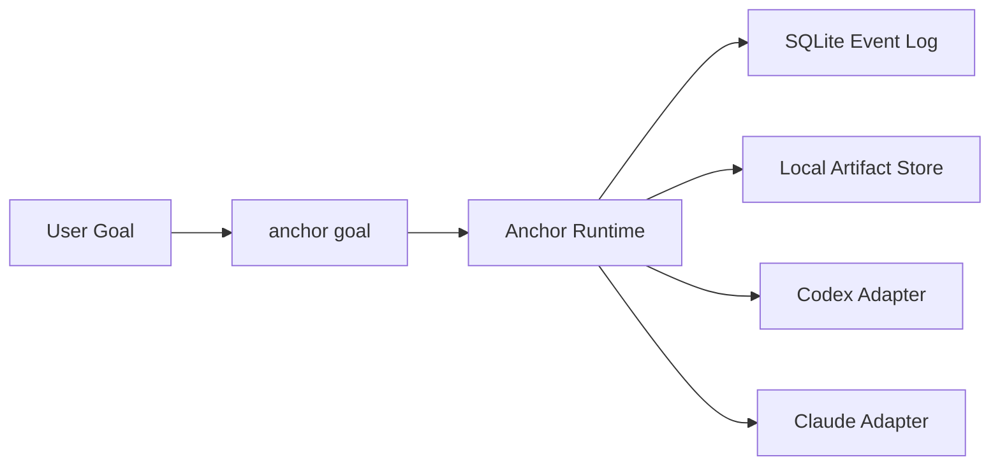

# Anchor

Anchor is a goal-first control runtime for coding agents.

It sits above execution backends like Codex and Claude Code, keeps the control loop deterministic, records rounds in SQLite, stores artifacts locally, and exposes a single user-facing command:

```bash
anchor goal
```

## Why Anchor

- One goal-oriented entrypoint instead of fragmented plan/execute/debug modes
- Backend-agnostic control over Codex and Claude Code
- Append-only event log with replayable task state
- Local artifacts for transcripts, patches, and command logs
- Resume-aware runtime model and explicit terminal reasons

## Install

For end users, the intended path is the npm installer package:

```bash
npx anchor-workflow install
```

That installs:

- Codex skill: `~/.codex/skills/anchor-control`
- Claude skill: `~/.claude/skills/anchor-control`
- Claude command: `~/.claude/commands/anchor/goal.md`

For local development inside this repo:

```bash
pnpm install
pnpm typecheck
pnpm test
pnpm anchor:doctor -- --json
pnpm anchor --help
pnpm anchor-workflow install
```

## Use

Direct CLI:

```bash
pnpm anchor goal --backend codex --goal "Implement the auth migration and verify it" --cwd D:\repo --json
```

Skill wrapper:

```powershell
.\integrations\codex\skills\anchor-control\scripts\anchor-control.ps1 doctor -Json
.\integrations\codex\skills\anchor-control\scripts\anchor-control.ps1 goal -Backend codex -Goal "Implement the auth migration and verify it" -Cwd "D:\repo" -Json
```

## Architecture



Core packages:

- `packages/core`: canonical schema, runtime, evaluator, strategy logic
- `packages/storage-sqlite`: append-only event store and projections
- `packages/artifact-store-local`: local filesystem artifact handling
- `packages/adapter-codex`: Codex CLI subprocess adapter
- `packages/adapter-claude`: Claude Code CLI subprocess adapter
- `packages/cli`: user-facing `anchor` command
- `packages/workflow`: goal-first facade over the runtime
- `packages/installer`: npm-installable skill installer

Host integrations:

- `integrations/codex/skills/anchor-control`
- `integrations/claude/skills/anchor-control`
- `integrations/claude/commands/anchor`

Design specs remain under `Anchor/`.

## Storage

By default, Anchor writes runtime data under `.anchor/`:

- SQLite database: `.anchor/anchor.db`
- Artifacts: `.anchor/artifacts/`

Artifacts are for inspection and traceability. Control decisions come from the event log and projections.

## Publishing

The npm package is published from `packages/installer` as `anchor-workflow`.

Local release flow:

```bash
cd packages/installer
npm login
npm publish --access public
```

Automated release flow:

- GitHub Action: [.github/workflows/publish-anchor-workflow.yml](/D:/dya/code/agent/.github/workflows/publish-anchor-workflow.yml)
- Trigger tag format: `anchor-workflow-v<version>`
- Required secret: `NPM_TOKEN`

Example:

```bash
git tag anchor-workflow-v0.1.0
git push origin anchor-workflow-v0.1.0
```
