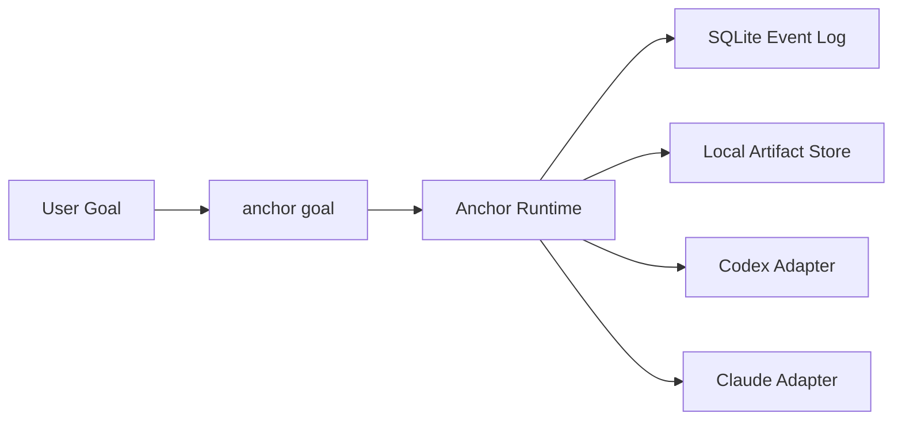

# Anchor

[English](./README.md) | [简体中文](./README.zh-CN.md)

Anchor is a goal-first control runtime for coding agents.

It sits above execution backends like Codex and Claude Code, keeps the control loop deterministic, records rounds in SQLite, stores artifacts locally, and exposes one user-facing action:

```bash
anchor goal
```

Anchor is for the cases where "just let the agent run" is not enough. It gives you a stable control layer with memory, replay, and explicit stop decisions.

## Quick Start

Install the public package:

```bash
npx anchor-workflow install
```

Then use Anchor from Codex or Claude Code through the installed skill/command, or call the local CLI directly during development:

```bash
pnpm anchor goal --backend codex --goal "Implement the auth migration and verify it" --cwd D:\repo --json
```

## What You Get

- One goal-oriented entrypoint instead of fragmented plan/execute/debug modes
- Backend-agnostic control over Codex and Claude Code
- Append-only event log with replayable task state
- Local artifacts for transcripts, patches, and command logs
- Resume-aware runtime model and explicit terminal reasons

## Install

For end users, the intended path is the npm installer package:

```bash
npx anchor-workflow install
```

That installs these host-facing assets:

- Codex skill: `~/.codex/skills/anchor-control`
- Claude skill: `~/.claude/skills/anchor-control`
- Claude command: `~/.claude/commands/anchor/goal.md`

For local development inside this repo:

```bash
pnpm install
pnpm typecheck
pnpm test
pnpm anchor:doctor -- --json
pnpm anchor --help
pnpm anchor-workflow install
```

## Use Anchor

Direct CLI:

```bash
pnpm anchor goal --backend codex --goal "Implement the auth migration and verify it" --cwd D:\repo --json
```

Repo-local skill wrapper:

```powershell
.\integrations\codex\skills\anchor-control\scripts\anchor-control.ps1 doctor -Json
.\integrations\codex\skills\anchor-control\scripts\anchor-control.ps1 goal -Backend codex -Goal "Implement the auth migration and verify it" -Cwd "D:\repo" -Json
```

What Anchor persists by default:

- SQLite database: `.anchor/anchor.db`
- Artifacts: `.anchor/artifacts/`

Artifacts are for inspection and traceability. Control decisions come from the event log and projections.

## How It Works



Anchor does three things:

- normalize a user goal into a controlled round loop
- evaluate backend output with explicit runtime rules
- store enough state to inspect, replay, and reason about failure patterns
