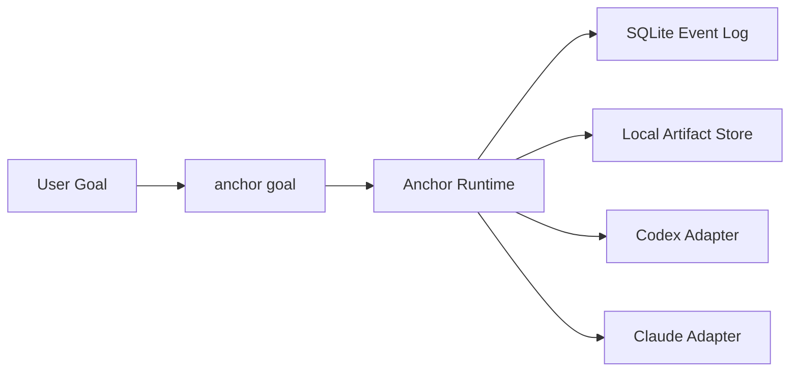

# Anchor

[English](./README.md) | [简体中文](./README.zh-CN.md)

One goal. Controlled execution. Replayable state.

Anchor is a control layer for coding agents. It sits above Codex and Claude Code, runs a deterministic round loop, records what happened, and stops for explicit reasons instead of vague agent exits.

## Start In One Step

```bash
npx anchor-workflow install
```

That installs Anchor into:

- Codex: `~/.codex/skills/anchor-control`
- Claude Code: `~/.claude/skills/anchor-control`
- Claude command: `~/.claude/commands/anchor/goal.md`

## The Core Action

Anchor is built around one command:

```bash
anchor goal
```

Example:

```bash
pnpm anchor goal --backend codex --goal "Implement the auth migration and verify it" --cwd D:\repo --json
```

If you are calling the installed skill assets directly, use the cross-platform wrapper:

```bash
node ./scripts/anchor-control.mjs doctor --json
node ./scripts/anchor-control.mjs goal --backend codex --goal "Implement the auth migration and verify it" --cwd "/path/to/repo" --json
```

## Why Use Anchor

Most coding agents are good at trying things. They are much worse at:

- recognizing repeated failure patterns
- carrying structured memory across attempts
- separating backend self-report from trusted execution evidence
- leaving behind a durable execution record you can inspect later

Anchor handles that control layer.

## What You Get

- a single goal-first entrypoint
- the same control model above Codex and Claude Code
- append-only task history in SQLite
- local artifacts for transcripts, patches, and command logs
- explicit terminal reasons and replayable state

## How It Works



At a high level, Anchor:

1. turns a user goal into a controlled round loop
2. evaluates backend output with explicit runtime rules
3. records state for replay, inspection, and failure analysis

## Local State

By default, Anchor writes under `.anchor/`:

- SQLite database: `.anchor/anchor.db`
- artifacts: `.anchor/artifacts/`

Artifacts are for traceability and inspection. Control decisions come from the event log and projections.

## Build From Source

```bash
pnpm install
pnpm typecheck
pnpm test
pnpm anchor:doctor -- --json
pnpm anchor --help
pnpm anchor-workflow install
```
