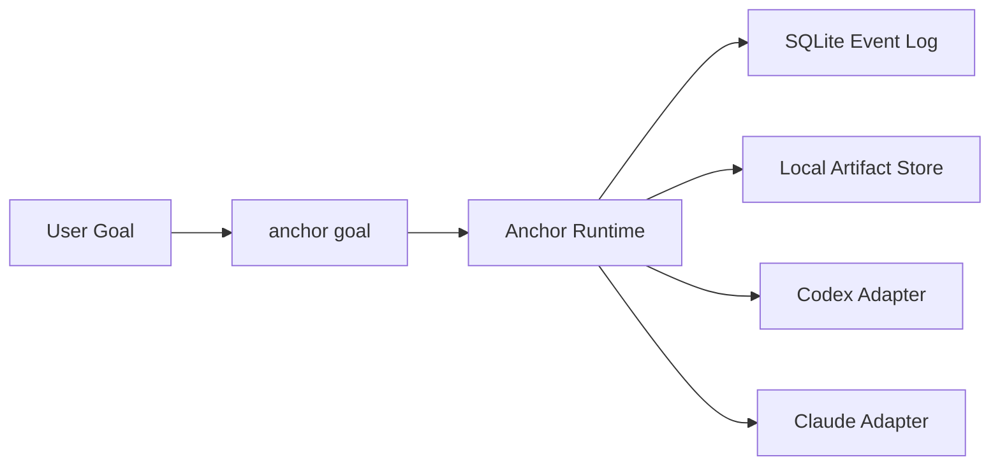

# Anchor

[English](./README.md) | [简体中文](./README.zh-CN.md)

Anchor is a goal-first control layer for coding agents.

Use it when you do not just want "an agent that runs", but a runtime that can keep state, remember failures, stop for explicit reasons, and leave a replayable ledger behind.

## Install

```bash
npx anchor-workflow install
```

This installs:

- a Codex skill at `~/.codex/skills/anchor-control`
- a Claude Code skill at `~/.claude/skills/anchor-control`
- a Claude command at `~/.claude/commands/anchor/goal.md`

## Use

Anchor is designed around one action:

```bash
anchor goal
```

Typical local CLI usage:

```bash
pnpm anchor goal --backend codex --goal "Implement the auth migration and verify it" --cwd D:\repo --json
```

If you are invoking the installed skill assets directly, use the cross-platform wrapper:

```bash
node ./scripts/anchor-control.mjs doctor --json
node ./scripts/anchor-control.mjs goal --backend codex --goal "Implement the auth migration and verify it" --cwd "/path/to/repo" --json
```

## What Anchor Adds

- one goal-oriented entrypoint instead of fragmented plan/execute/debug flows
- the same control model above Codex and Claude Code
- append-only task history in SQLite
- local artifacts for transcripts, patches, and command logs
- explicit terminal reasons instead of vague agent exits

## Why It Exists

Most coding agents are good at trying things. They are much worse at:

- knowing when they are stuck in the same failure pattern
- carrying structured memory across attempts
- distinguishing backend self-report from trusted execution evidence
- leaving a durable trace that you can inspect later

Anchor exists to handle that control layer.

## How It Works



At a high level, Anchor:

1. turns a user goal into a controlled round loop
2. evaluates backend output with explicit runtime rules
3. records state for replay, inspection, and failure analysis

## Local State

By default, Anchor writes under `.anchor/`:

- SQLite database: `.anchor/anchor.db`
- artifacts: `.anchor/artifacts/`

Artifacts are for traceability and inspection. Control decisions come from the event log and projections.

## Develop

If you are working on this repository itself:

```bash
pnpm install
pnpm typecheck
pnpm test
pnpm anchor:doctor -- --json
pnpm anchor --help
pnpm anchor-workflow install
```
