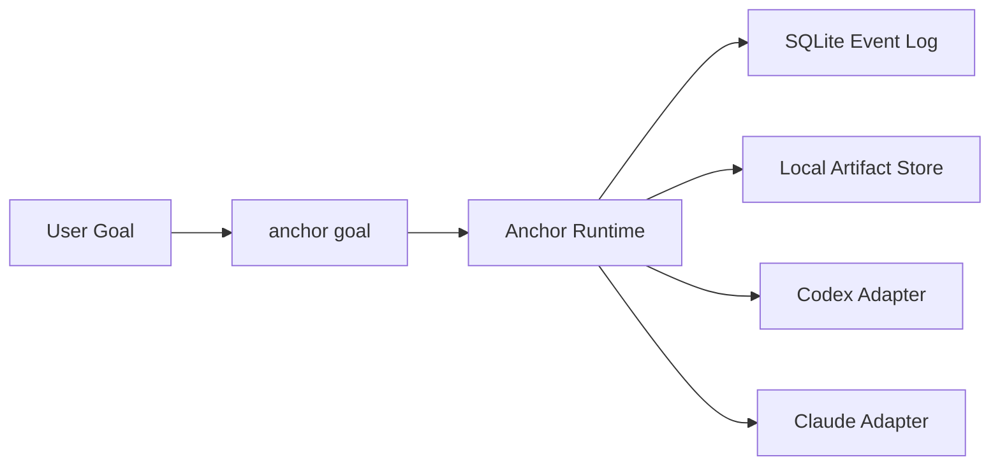

# Anchor

[English](./README.md) | [简体中文](./README.zh-CN.md)

一个目标。受控执行。可回放状态。

Anchor 是一个面向编码 agent 的控制层。它位于 Codex 和 Claude Code 之上，负责运行确定性的 round loop、记录实际发生过的事情，并且以明确原因停止，而不是给你一个模糊的 agent 退出结果。

## 一步开始

```bash
npx anchor-workflow install
```

它会把 Anchor 安装到：

- Codex：`~/.codex/skills/anchor-control`
- Claude Code：`~/.claude/skills/anchor-control`
- Claude command：`~/.claude/commands/anchor/goal.md`

## 核心动作

Anchor 对外只围绕一个命令构建：

```bash
anchor goal
```

示例：

```bash
pnpm anchor goal --backend codex --goal "Implement the auth migration and verify it" --cwd D:\repo --json
```

如果你是直接调用安装后的 skill 资源，推荐使用跨平台 wrapper。若安装动作来自 Anchor 源码仓库，或显式传入了 `--repo-root`，安装器会自动记录运行时工作区；否则请设置 `ANCHOR_REPO_ROOT`，或者保证 `anchor` 已经在 `PATH` 中可用：

```bash
node ./scripts/anchor-control.mjs doctor --json
node ./scripts/anchor-control.mjs goal --backend codex --goal "Implement the auth migration and verify it" --cwd "/path/to/repo" --json
```

## 为什么用 Anchor

大多数编码 agent 很擅长不断尝试，但不擅长：

- 识别重复出现的失败模式
- 在多轮尝试之间保留结构化记忆
- 区分 backend 自述和可信执行证据
- 留下一份之后还能检查的持久执行记录

Anchor 补上的就是这层控制。

## 你会得到什么

- 一个以目标为中心的统一入口
- 同一套控制模型同时覆盖 Codex 和 Claude Code
- 落到 SQLite 的 append-only task history
- 本地 artifacts，用于保存 transcript、patch 和 command log
- 明确的 terminal reason 和可回放状态

## 工作方式



高层上，Anchor 做三件事：

1. 把用户目标转成受控的 round loop
2. 用明确的 runtime 规则评估 backend 输出
3. 保存可用于 replay、inspect 和失败分析的状态

## 本地状态

默认情况下，Anchor 会写入 `.anchor/`：

- SQLite 数据库：`.anchor/anchor.db`
- artifacts：`.anchor/artifacts/`

Artifacts 用于追踪和检查。真正的控制决策来自 event log 和 projections。

## 从源码构建

```bash
pnpm install
pnpm typecheck
pnpm test
pnpm anchor:doctor -- --json
pnpm anchor --help
pnpm anchor-workflow install
```
