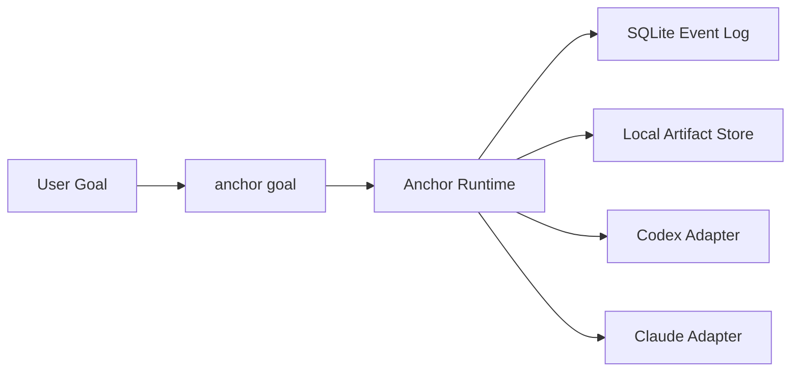

# Anchor

[English](./README.md) | [简体中文](./README.zh-CN.md)

Anchor 是一个面向编码 agent 的、以目标为中心的控制运行时。

它位于 Codex 和 Claude Code 这类执行后端之上，负责保持控制循环可预测、将 round 记录到 SQLite、把 artifacts 落到本地，并对外暴露一个面向用户的动作：

```bash
anchor goal
```

当“让 agent 自己跑”已经不够的时候，Anchor 就有意义了。它提供了带记忆、可回放、并且停止决策明确的控制层。

## Quick Start

安装公开 npm 包：

```bash
npx anchor-workflow install
```

安装完成后，可以在 Codex 或 Claude Code 中通过已安装的 skill/command 使用 Anchor；开发阶段也可以直接调用本地 CLI：

```bash
pnpm anchor goal --backend codex --goal "Implement the auth migration and verify it" --cwd D:\repo --json
```

## 能得到什么

- 一个以 `goal` 为中心的统一入口，而不是拆成 plan/execute/debug 多套模式
- 面向 Codex 和 Claude Code 的后端无关控制层
- 可回放的 append-only event log
- 本地 artifacts，用于保存 transcript、patch 和 command log
- 带恢复语义的 runtime 模型，以及显式 terminal reason

## 安装

面向终端用户，推荐直接使用 npm 安装器：

```bash
npx anchor-workflow install
```

它会安装这些宿主侧资源：

- Codex skill：`~/.codex/skills/anchor-control`
- Claude skill：`~/.claude/skills/anchor-control`
- Claude command：`~/.claude/commands/anchor/goal.md`

如果你是在这个仓库里做本地开发，可以这样：

```bash
pnpm install
pnpm typecheck
pnpm test
pnpm anchor:doctor -- --json
pnpm anchor --help
pnpm anchor-workflow install
```

## 使用 Anchor

直接使用 CLI：

```bash
pnpm anchor goal --backend codex --goal "Implement the auth migration and verify it" --cwd D:\repo --json
```

使用仓库内的 skill wrapper：

```powershell
.\integrations\codex\skills\anchor-control\scripts\anchor-control.ps1 doctor -Json
.\integrations\codex\skills\anchor-control\scripts\anchor-control.ps1 goal -Backend codex -Goal "Implement the auth migration and verify it" -Cwd "D:\repo" -Json
```

Anchor 默认会持久化这些内容：

- SQLite 数据库：`.anchor/anchor.db`
- Artifacts：`.anchor/artifacts/`

Artifacts 用于检查和追踪。真正的控制决策来自 event log 和 projections。

## 工作方式



Anchor 主要做三件事：

- 把用户目标规范化成受控的 round loop
- 用明确的 runtime 规则评估 backend 输出
- 保存足够的状态用于 inspect、replay 和失败模式分析
