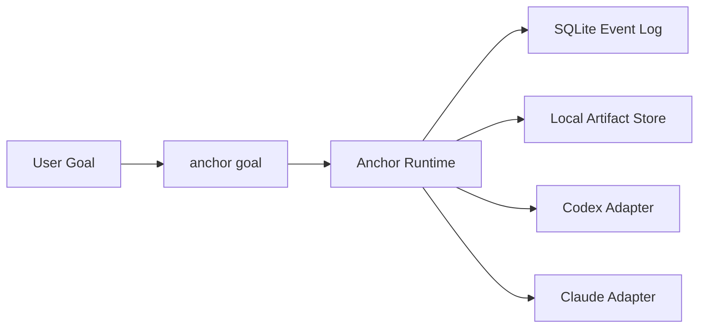

# Anchor

[English](./README.md) | [简体中文](./README.zh-CN.md)

Anchor 是一个面向编码 agent 的、以目标为中心的控制层。

如果你要的不是“让 agent 自己跑”，而是一个能保留状态、记住失败、以明确原因停止、并且留下可回放执行账本的 runtime，那么 Anchor 就是为这个场景准备的。

## 安装

```bash
npx anchor-workflow install
```

它会安装：

- Codex skill：`~/.codex/skills/anchor-control`
- Claude Code skill：`~/.claude/skills/anchor-control`
- Claude command：`~/.claude/commands/anchor/goal.md`

## 使用

Anchor 对外的核心动作只有一个：

```bash
anchor goal
```

本地 CLI 的典型用法：

```bash
pnpm anchor goal --backend codex --goal "Implement the auth migration and verify it" --cwd D:\repo --json
```

如果你是直接调用安装后的 skill 资源，推荐使用跨平台 wrapper：

```bash
node ./scripts/anchor-control.mjs doctor --json
node ./scripts/anchor-control.mjs goal --backend codex --goal "Implement the auth migration and verify it" --cwd "/path/to/repo" --json
```

## Anchor 带来了什么

- 一个以 `goal` 为中心的统一入口，而不是拆成 plan/execute/debug 多条流程
- 同一套控制模型同时覆盖 Codex 和 Claude Code
- 落到 SQLite 的 append-only task history
- 本地 artifacts，用于保存 transcript、patch 和 command log
- 明确的 terminal reason，而不是模糊的 agent 退出状态

## 为什么需要它

大多数编码 agent 很擅长不断尝试，但不擅长：

- 判断自己是否卡在同一类失败模式里
- 在多轮尝试之间保留结构化记忆
- 区分 backend 自述和可信执行证据
- 留下一份之后还能检查的持久执行轨迹

Anchor 的作用就是把这层控制补上。

## 工作方式



高层上，Anchor 做三件事：

1. 把用户目标转成受控的 round loop
2. 用明确的 runtime 规则评估 backend 输出
3. 保存可用于 replay、inspect 和失败分析的状态

## 本地状态

默认情况下，Anchor 会写入 `.anchor/`：

- SQLite 数据库：`.anchor/anchor.db`
- artifacts：`.anchor/artifacts/`

Artifacts 用于追踪和检查。真正的控制决策来自 event log 和 projections。

## 本地开发

如果你是在维护这个仓库本身：

```bash
pnpm install
pnpm typecheck
pnpm test
pnpm anchor:doctor -- --json
pnpm anchor --help
pnpm anchor-workflow install
```
